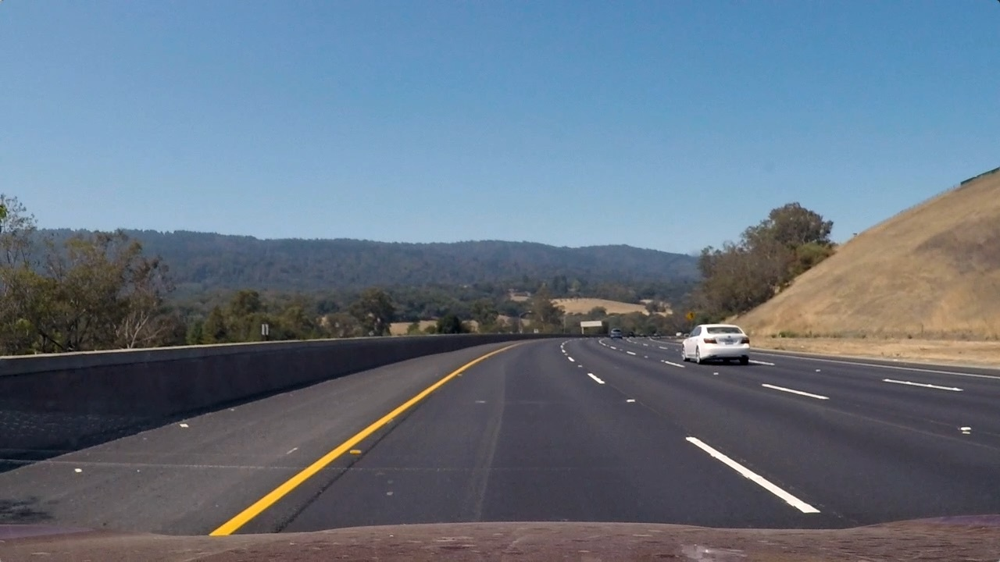
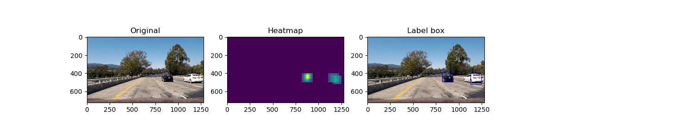
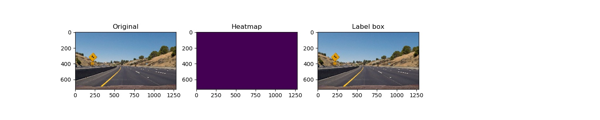

## Writeup Template
### You can use this file as a template for your writeup if you want to submit it as a markdown file, but feel free to use some other method and submit a pdf if you prefer.

---

**Vehicle Detection Project**

The goals / steps of this project are the following:

* Perform a Histogram of Oriented Gradients (HOG) feature extraction on a labeled training set of images and train a classifier Linear SVM classifier
* Optionally, you can also apply a color transform and append binned color features, as well as histograms of color, to your HOG feature vector.
* Note: for those first two steps don't forget to normalize your features and randomize a selection for training and testing.
* Implement a sliding-window technique and use your trained classifier to search for vehicles in images.
* Run your pipeline on a video stream (start with the test_video.mp4 and later implement on full project_video.mp4) and create a heat map of recurring detections frame by frame to reject outliers and follow detected vehicles.
* Estimate a bounding box for vehicles detected.

## [Rubric](https://review.udacity.com/#!/rubrics/513/view) Points
### Here I will consider the rubric points individually and describe how I addressed each point in my implementation.

---
### Writeup / README

#### 1. Provide a Writeup / README that includes all the rubric points and how you addressed each one.  You can submit your writeup as markdown or pdf.  [Here](https://github.com/udacity/CarND-Vehicle-Detection/blob/master/writeup_template.md) is a template writeup for this project you can use as a guide and a starting point.

You're reading it!

Please note all code for this project can be found inside the `code`
directory.

### Histogram of Oriented Gradients (HOG)

#### 1. Explain how (and identify where in your code) you extracted HOG features from the training images.

Inside the files: `trainer.py` and `features.py` the training pipeline
 can be found containing the HOG feature extraction.

I used a combination fo HOG, spatial binned color and  histograms of
color for feature extraction from the training images.

The final chosen HOG parameters where:

- orient = 9
- pix_per_cell = 8
- cell_per_block = 2
- hog_channel = 'ALL'
- block_norm = 'L1'

I've experimented a bit with color spaces and parameter combinations,
but as a lot of people pointed out the above seemed to work best, and
I also had success with them.

Setting block_norm to L1 also helped a lot to reduce false detections.

The training dataset (cars and not cars) used for this project was the
formed by the one provided for the project.

Here you can find a sample:

For future iterations: using additional data could be a good idea
to see if the accuracy can be boosted and also be able to detect other
objects like: pedestrians and traffic signs.

In the below images the output of this phase can be visualized:

#### 2. Explain how you settled on your final choice of HOG parameters.

As stated above, I've tried various combinations, of parameters and the
following channels: RGB, HSV, LUV, HLS, YUV, YCrCb.

After some digging around, most people pointed out to try the parames
picked above and they seemed to perform the best.

#### 3. Describe how (and identify where in your code) you trained a classifier using your selected HOG features (and color features if you used them).

Inside the `trainer.py` the function `train` will take in input the
following params (related to feature extraction): color_space,
spatial_size, hist_bins, orient, pix_per_cell, cell_per_block,
hog_channel.

The first step is to extract car and not car features, shuffle and
split the dataset into an 80/20 train/test.

The StandardScaler form sklearn was used to normalize the data.

As pointed out in the lessons the `LinearSVC` worked well enough for
this project and kept training quite fast. I managed to obtain the
final test accuracy of 99.16%.

The model parameters were pickeled in a file for later usage.

### Sliding Window Search

#### 1. Describe how (and identify where in your code) you implemented a sliding window search.  How did you decide what scales to search and how much to overlap windows?

Using the provided `find_cars` in from the lessons and the following
parameters for y_start, y_stop and scale:

    (380, 480, 1.0)
    (400, 600, 1.5)
    (480, 680, 2.5)

Ideally we want to search for small cars far from the camera and for
bigger cars near the camera. It is not useful to search on the entire
image, thus, the limitation in size

You may visualize an image for each scale:

*SCALE 1.0*

*SCALE 1.5*

*SCALE 2.5*

Scale parameters where chosen after experimenting a bit and looking at
what other people chose to use.

#### 2. Show some examples of test images to demonstrate how your pipeline is working.  What did you do to optimize the performance of your classifier?

After a couple of very bad and buggy feature extraction algorithms, I
chose to keep it simple and try what seemed to work best from the
lessons and what other people also pointed out.

Image was converted to YCrCb color scale. All 3 channels were used for
HOG features, spatial binned color + histograms of color were also used.

I used 3 different scales to search for cars, which have a lot of vertical
overlap. The lower the amount of rectangles to search, the better the
overall performance of the pipline will get. This could also be a point
where further effort can be put. I am satisfied with the level
of speed achieved.

Here are some examples of the `find_cars`  (found in `car_finder.py`)
function which returns all the detections from images.

The following issues occured:

- on the `test3` image it fails to detect the car
- on the `test5` image there is a false positive

---

### Video Implementation

#### 1. Provide a link to your final video output.  Your pipeline should perform reasonably well on the entire project video (somewhat wobbly or unstable bounding boxes are ok as long as you are identifying the vehicles most of the time with minimal false positives.)
Here's a [link to my video result](./out_project_video.mp4)

You can visualize the pipeline loosing the white car for a couple of
frames at moments.

Better performance could be obtained by using more training data. Also
the white car is not completly detected when it starts to get out of the
camera. Dataset augmentation with partially visible cars could help
with this issue.

#### 2. Describe how (and identify where in your code) you implemented some kind of filter for false positives and some method for combining overlapping bounding boxes.

Positions of positive detection were recorded in each video frame,
creating a heatmap for each positive detection and thresholded the map
to filter out false positive and identify vehicle positons. In oder to
count and detect final bounding boxes the `scipy.ndimage.measurements.label()`
function was used. I assumed each labeled area to corresponded to a
detection.

Another optimization, which was heavily inspired, was to keep track of
the last 6 heatmps and use their frames to create a limited search.
Every 5 frames, a full search will be done. This finally solved the
problem of missing cars from frame to frame.

You can visualize this inside the functions:
 `CarDetector.get_boxes()` and `CarDetector.search_for_boxes_at_scale()`
 inside the `car_detection.py` file.

Below you can visualize the result of the pipeline on single images.

You can see that the pipeline, when working with single images
has can't detect the white car for test3 and test6 images.

In the video the car is skipped in a minimum amount of frames.

---

### Discussion

#### 1. Briefly discuss any problems / issues you faced in your implementation of this project.  Where will your pipeline likely fail?  What could you do to make it more robust?

The primary issue with this pipeline is the car detection. Until the
final introduction of the optimization it did quite poorly on the final
video. As stated before, more training data can help fix the problem.

Creating a fast way to extract features was a big problem, I struggled
at the beginning trying with a different approach, but i had to revert
back to the one suggested by the project which most people seemed to
follow and had success with.

Ultimately, car detection was very bad without and knowledge of the
past from frame to frame, introducting some basic form of memory in
the pipeline helped quite a lot with the overall performance.